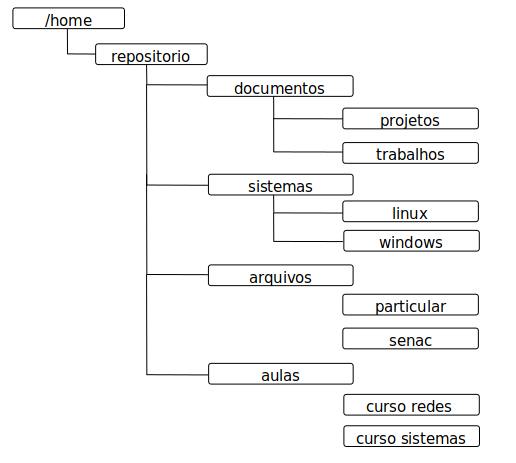

## Tarefa 01:
### Criação de Diretórios e Arquivos

1. Dentro do diretório /home crie a seguinte estrutura de diretórios:



```bash
cd /home
```

Criado os diretórios **projeto** e **trabalhos**:
```bash
mkdir -p repositorio/documentos/projetos
mkdir -p repositorio/documentos/trabalhos
```
Criando os diretórios **linux** e **windows**:

```bash
mkdir -p repositorio/sistemas/linux
mkdir -p repositorio/sistemas/windows
```

Criando os diretórios **particular** e **senac**:
```bash
mkdir -p repositorio/arquivo/particular
mkdir -p repositorio/arquivo/senac
```

Criando os diretórios **curso redes** e **curso sistemas**:
```bash
mkdir -p repositorio/aulas/curso\ redes
mkdir -p repositorio/aulas/curso\ sistemas
```

2. No diretório projetos, crie os arquivos projeto01.doc e projeto02.doc

```bash
touch repositorio/documentos/projetos/projeto01.doc
touch repositorio/documentos/projetos/projeto02.doc
```

3. No diretório particular, crie os arquivos lista.doc e telefones.doc

```bash
touch repositorio/arquivo/particular/lista.doc
touch repositorio/arquivo/particular/telefones.doc
```

4. No diretório “curso redes”, crie os arquivos aula01.doc e aula02.doc

```bash
touch repositorio/aulas/curso\ redes/aula01.doc
touch repositorio/aulas/curso\ redes/aula02.doc
```

> **Obs.:**
>
> Para o debian usa-se o ```su -```
>
> Em distros baseadas em debian usam o ```sudo```.

***

## Tarefa 02:
### Manipulação de Arquivos e Diretórios:
1. Crie no diretório /home um novo diretório chamado backup:

```bash
cd /home
mkdir backup
```

2. Copie, preservando seus atributos originais, o diretório /etc/network para dentro do diretório backup:

```bash
cp /etc/network backup/ -p
```

3. Renomeie a cópia do diretório network para 01-network.

```bash
mv backup/network backup/01-network
```

4. Copie, preservando seus atributos originais, o arquivo /etc/passwd para dentro do diretório backup, modificando seu nome para 02-usuarios.lst:

```bash
cp /etc/passwd backup/02-usuarios.lst -p
```

5. Com o comando find, pesquise no a localização do arquivo ssh_config:

```bash
find /etc -name ssh_config
```

6. Copie o arquivo ssh_config para dentro do diretório backup, renomeando-o para 03-ssh_config

```bash
cp /etc/ssh/ssh_config backup/03-ssh_config
```

7. No diretório /etc empacote e compacte o diretório apt (nome dopacote 04-apt.tar).

```bash
tar -cf 04-apt.tar /etc/apt
```

8. Mova o arquivo 04-apt.tar para dentro do diretório backup:

```bash
mv 04-apt.tar backup/
```


9. Copie o diretório /etc/default para dentro diretório backup, preservando seus atributos originais. Renomeie o diretório copiado para 05-default.

```bash
cp -R /etc/default/ backup/05-default  -p
```

10. Faça uma cópia do arquivo group, para dentro do diretório backup, renomeando-o para 06-grupo.lst.

```bash
cp /etc/group backup/06-group.lst
```

11. Com o comando find, pesquise no diretório /etc a localização do arquivo sources.list:

```bash
sudo find / -name source.list
```

12. Crie uma cópia do arquivo sources.list dentro do diretório backup, renomenado-o para 07-sources.list:

```bash
cp /etc/apt/source.list backup/07-sources.list
```

13. Acesse o Blackbord através do navegador de sua máquina virtual e faça o download do arquivo 08-logs.tar.bz2:

- [x] Baixado

```bash
wget -c https://senac.blackboard.com/bbcswebdav/
pid-5128927-dt-content-rid-181851715_1/courses/
RS-20201-FSPOA-ASOI-PRE-RD3M20-1/08-logs.tar.bz2 -o 08-logs.tar.bz2
```

14. Mova o arquivo para dentro do diretório /home/backup:

```bash
mv 08-logs.tar.bz2 backup/
```

15. Descompacte o arquivo:

```bash
tar -xjf backup/08-logs.tar.bz2 -C backup/08-logs
```

16. No diretório descompactado:
  * Remova o diretório news:

  ```bash
    rm -R backup/08-logs/news/
  ```

  * Remova o arquivo 08-logs.tar.bz2, mantendo apenas o diretório descompactado.

  ```bash
  rm backup/08-logs.tar.bz2
  ```

> **Obs.:**
>
> Para o debian usa-se o ```su -```
>
> Em distros baseadas em debian usam o ```sudo```.

***

## Tarefa 03:
### Filtros e redirecionadores:

1. No diretório /home crie um diretório chamado filtros:

```bash
cd /home
mkdir filtros
```

2. Com o comando cut, crie no diretório filtros uma lista contendo somente os nomes de usuários do sistema (em ordem alfabética) com o nome de 01-usuarios.lst:

```bash
cut /etc/passwd -d ':' -f 1 | sort -d > filtros/01-usuarios.lst
```

3. Com o comando cut, crie no diretório filtros uma lista contendo somente os nomes dos  grupos do sistema (em ordem alfabética) com o nome de 02-grupos.lst:

```bash
cut /etc/group -d : -f 1 | sort -d > filtros/02-grupos.lst
```

4. No diretório filtros, crie um arquivo contendo as 30 últimas linhas do arquivo auth.log.1: (o nome do arquivo deverá ser 03-auth.log).

```bash
cat /var/log/auth.log.1 > filtros/03-auth.log
```

5. No diretório filtros, crie um arquivo contendo as 20 primeiras linhas do arquivo syslog.1: (o nome do arquivo deverá ser 04-syslog.log).

```bash
cat /var/log/sislog.1 > filtros/04-syslog.log
```

6. Acesse o Blackbord através do navegador de sua máquina virtual e faça o download da lista disponível na Aula 07:

- [x] Baixado

```bash
wget -c https://senac.blackboard.com/bbcswebdav/
pid-5128927-dt-content-rid-181851714_1/courses/
RS-20201-FSPOA-ASOI-PRE-RD3M20-1/lista01.csv -o lista01.csv
```

7. Mova o arquivo lista01.csv para dentro do diretório /home/filtros:

```bash
mv lista01.csv filtros/
```

8. Com o comando cut, crie dentro do diretório filtros um arquivo denominado          05-contatos.csv contendo a lista com o nome dos funcionários, e-mails e telefones de contato existentes no arquivo lista01.csv.

```bash
cut filtros/lista01.csv -d : -f 1,2,3 > filtros/05-contato.csv
```

9. Com o comando cut, crie dentro do diretório filtros um arquivo denominado         06-rh.csv contendo a lista com o nome dos funcionários, setor e CPF existentes no arquivo lista01.csv.

```bash
cut filtros/lista01.csv -d : -f 1,4,5 > filtros/06-rh.csv
```

10. Com o comando cut, crie dentro do diretório filtros um arquivo denominado         07-nomes.csv contendo a lista com o nome dos funcionários existentes no arquivo lista01.csv. (Esta lista deve estar em ordem alfabética).

```bash
cut filtros/lista01.csv -d : -f 1 | sort -d > filtros/07-nomes.csv
```

11. Com o comando cat filtre a palavra network no arquivo /var/log/messages.1 direcionando o resultado para um arquivo denominado 08-net.log (este arquivo deve ser salvo no diretório filtros)

```bash
cat /var/log/messages.1 | grep network > filtros/08-net.log
```

12. Dentro do diretório filtros crie um novo arquivo com nome de 09-inodes.info contento as informações referentes ao uso de endereços inodes do sistema.


```bash
sudo df -i > filtros/09-inodes.info
```

> **Obs.:**
>
> Para o debian usa-se o ```su -```
>
> Em distros baseadas em debian usam o ```sudo```.

***

## Tarefa 04:
### Níveis de Execução:
1. Crie um arquivo chamado script.sh no diretório /etc/init.d/:

```bash
touch /etc/init.d/script.sh
```

2. Edite o arquivo e insira as seguintes linhas:

> Obs.: Para editar o arquivo considere utilizar o editor vim ou nano:

Salvando no **/etc/init.d/** (**systemV**):
```shell
[gustavo@pcGustavo ~]# nano /etc/init.d/script.sh
```
Salvando no **/etc/systemd/system/** (**systemD**):
```shell
[gustavo@pcGustavo ~]# nano /etc/init.d/script.sh
```

Conteúdo do arquivo:
```bash              
#!/bin/bash

kdialog --msgbox "Criando arquivo log ......"
kdialog --password "Digite sua senha:" | sudo -S dmesg  > /tmp/messages.log
```


3. Torne o arquivo executável com o seguinte comando
```chmod```:

Tornando executavel **systemV**:
```bash
chmod +x /etc/init.d/script.sh
```


Tornando executavel **systemD**:
```bash
chmod +x /etc/systemd/system/script.service
```

4. Adicione o script criado na inicialização do sistema:

Adicionando no **systemV**:
```bash
inserv -d script.sh
```

Adicionando no **systemD**:
```bash
sudo systemctl is-enabled script
```

5. Pare o serviço network-manager:

Adicionando no **systemV**:
```bash
service network-manager stop
```

Adicionando no **systemD**:
```bash
systemctl status network.target
```

6. Remova da inicialização do sistema a aplicação network-manager:

```bash
insserv -r network-manager
```

7. Crie no diretório /home um novo diretório denominado runlevels:

```bash
cd /home
mkdir runlevels
```

8. Faça uma cópia do diretório /etc/rc5.d para dentro do diretório /home/runlevels: (renomeie o diretório para 01-rc5.d)

```bash
cp /etc/rc5.d runlevels/01-rc5.d
```

9. Crie dentro do diretório runlevels um arquivo com o nome de 02-messages.log contendo os logs da última inicialização do sistema.

```bash
sudo dmesg > runlevels/02-messages.log
```

10. Dentro do diretório runlevels, crie um arquivo chamado 03-unit.lst, contendo a lista de unidades (units) executadas na inicialização do sistema:

```bash
sudo systemctl list-units > runlevels/03-unit.lis
```

11. Dentro do diretório runlevels, crie um arquivo chamado 04-unit-failed.lst, contendo a lista de unidades (units) que falharam na inicialização do sistema:

```bash
systemctl --failed > runlevels/04-unit-failed.lst
```

12. Dentro do diretório runlevels, crie um arquivo denominado 05-boot.svg contendo a imagem gráfica vetorial detalhada do processo de inicialização do sistema:

```bash
systemd-analyze plot > runlevels/05-boot.svg
```


> **Obs.:**
>
> Para o debian usa-se o ```su -```
>
> Em distros baseadas em debian usam o ```sudo```.

***

# Criador
Olá me chamo Gustavo, e criei este material, para mais informações, clique nos links abaixo:

* [LinkTree](https://www.linktree.com.br/gusleaooliveira)


* Disponível em : [Repositório de exercícios](https://github.com/gusleaooliveira/materialEstudo)

