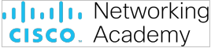

# Laboratório – O que foi roubado?

## Objetivos

Pesquise e leia sobre algumas ocorrências recentes de violação de segurança.

## Histórico/Cenário
As violações de segurança ocorrem quando indivíduos ou aplicações tentam obter acesso não autorizado a dados, aplicativos, serviços ou dispositivos. Durante essas violações, os invasores, sejam internos ou não, tentam obter informações para ganhos financeiros ou outras vantagens. Neste laboratório, vamos analisar algumas violações de segurança para determinar o que foi roubado, que métodos foram usados e o que você pode fazer para se proteger.

## Recursos necessários
​    • Computador ou dispositivo móvel com acesso à Internet

Pesquisa de violação de segurança
Para iniciar a pesquisa use o link fornecido sobre violações de segurança para preencher a tabela abaixo. 
https://epocanegocios.globo.com/Tecnologia/noticia/2019/12/os-maiores-casos-de-violacao-de-dados-de-2019.html
Procure OUTRAS fontes adicionais interessantes e registre suas descobertas na tabela abaixo.
*Você deve pesquisar CINCO cases de violação, de preferência entre os anos mais recentes.

|    Data da Incidência    | Empresa Afetada |             Quantas Vitimas? O que foi roubado?              | Que métodos foram usados? O que você Deve fazer para se proteger? |                     Fonte de referência                      |
| :----------------------: | :-------------: | :----------------------------------------------------------: | :----------------------------------------------------------: | :----------------------------------------------------------: |
|        27/11/2019        |    Prosegur     |      Todos os clientes da empresa. Os dados do cliente.      | O ransoware (chamado ryuk) que criptografava os dados dos clientes, pedindo dinheiro em formato de bytcoins. | [Link de referência](https://canaltech.com.br/hacker/prosegur-e-alvo-de-ataque-ransomware-e-precisa-parar-suas-operacoes-156717/) e [Link de referência](https://livecoins.com.br/prosegur-atacada-ransomware-pede-bitcoin-como-resgate/) e [Link de referência](https://www.enigmasoftware.com/pt/ryukransomware-remocao/) |
|           2019           |      Zynga      |       218 milhões de usuários. Os dados dos clientes.        |           O site foi invadido e os dados copiados.           | [Link de referência](https://www.dinheirovivo.pt/empresas/ataque-a-empresa-de-jogos-mobile-zynga-expoe-dados-de-200-milhoes-de-utilizadores/) e [Link de referência](https://gizmodo.uol.com.br/ataque-hacker-jogos-zynga-dados-170-milhoes-usuarios/) |
|           2019           |      Asus       | 1 milhão de usuários (computadores). Os dados dos clientes e infectar demais computadores. | Através do software de atualização, o malware (ShadowHammer) infectava e o computador. | [Link de referência](https://www.tecmundo.com.br/seguranca/139856-asus-solta-comunicado-ataque-hacker-infectou-milhares.htm) |
| 21/08/2018 - 05/09/2018  | British Airways |      380 mil pagamentos com cartão afetados e pessoais.      | Desvio do site para um site falso, onde foram colhidos os dados (como de login, do cartão e de reservas). | [Link de referência](https://extra.globo.com/noticias/economia/british-airways-multada-em-us230-mi-por-ataque-em-site-23791354.html) |
| 01/01/2016 - 22/12/2017  |     Orbitz      |        880 mil usuários. Dados bancários  e pessoais.        | Acesso dos hackers diretamente no site, onde foram roubados, nesse caso sendo copiados, os dados de reservas e logins. | [Link de referência](https://epocanegocios.globo.com/Tecnologia/noticia/2018/03/hackers-roubam-dados-de-880-mil-clientes-de-empresa-de-viagens-dos-eua.html) |
| 01/05/2015  - 04/07/2018 |   SingHealth    | 1,5 milhão de usuários. Dados pessoais e dados de histórico de medicamentos. | Acesso dos hackers diretamente na base dados do site, onde foram roubados, nesse caso sendo copiados, os dados de reservas e logins. | [Link de referência](https://canaltech.com.br/seguranca/hackers-roubam-dados-de-15-milhoes-de-pacientes-em-singapura-118436/) |
|        20/08/2018        |    T-Mobile     |      2 milhões de usuários. Dados pessoais e bancários.      | Dados pessoais e bancários foram acessados por uma api ([Interface de Programação de Aplicações](api-parte1.pdf))  e posteriormente criptografados. | [Link de referência](https://minutodaseguranca.blog.br/violacao-do-banco-de-dados-da-t-mobile-expoe-dados-de-2-milhoes-de-clientes/) |
|      2012 - 04/2018      |  myPersonality  | 4 milhões de usuários. Dados pessoais da rede social (Facebook). | O aplicativo fornecia os dados para quem solicitasse, sendo ou não anônimo, manipulando-os de maneira incorreta. | [Link de referência](https://canaltech.com.br/seguranca/outro-teste-psicologico-online-expos-dados-de-3-milhoes-de-usuarios-do-facebook-113788/) |

## Reflexão
Levando em consideração o que leu sobre as violações de segurança, o que você pode fazer para evitar esses tipos de violação?

| Métodos de prevenção |
|----|
| Tanto para usuários, quanto para impresas é necessário ter um antivírus, pois o mesmo pode, ao menos, ser usado para avisar de um possível vírus que possa infectar o sistema. |
| Manter o sistema operacional(ou os demais softwares e drivers)  sempre atualizados, evitando assim, que os hackers possam se utilizar de bugs, erros, ou mal funcionamento do S.O. ou de determinado software para se espalhar, como, por exemplo, no caso da ASUS. |
| Criar um firewall,  mudando o nome e senhas padrões, criando senhas seguras. |
| Softwares de controle de versão para demonstrar quem, e quando foi alterado. Além disso, ter políticas de segurança que permitam apenas que usuários permitidos alterem seus respectivos arquivos. |
| Softwares de backup e de armazenamento, com dropbox e google drive/docs. |
| Senhas fortes, que mesclem letras (maiúsculas e minúsculas), números e símbolos. Acrescenta-se também criptografia no sistema também é muito bem-vindo. |
| Ter mais controle sobre spams, tendo um bom filtro para evitar ataques, como os de phishing. |
| Evitar o uso de mídias removíveis , tendo políticas para o mesmo, e permitindo só quando realmente necessário o uso de mídias assim. |
| Treinamento para a equipe também é fundamental, assim, evitando que os colaboradores da empresa abram spams, ou permitam que um ransomware/malware venha a ser adquerido, mesmo que sem a intenção. |
| Monitorar o consumo da rede e como os colaboradores a utilizam. |

***

# Criador
Olá me chamo Gustavo, e criei este material, para mais informações, clique nos links abaixo:

* [LinkTree](https://www.linktree.com.br/gusleaooliveira)

* Disponível em : [Repositório de exercícios](https://github.com/gusleaooliveira/materialEstudo)
